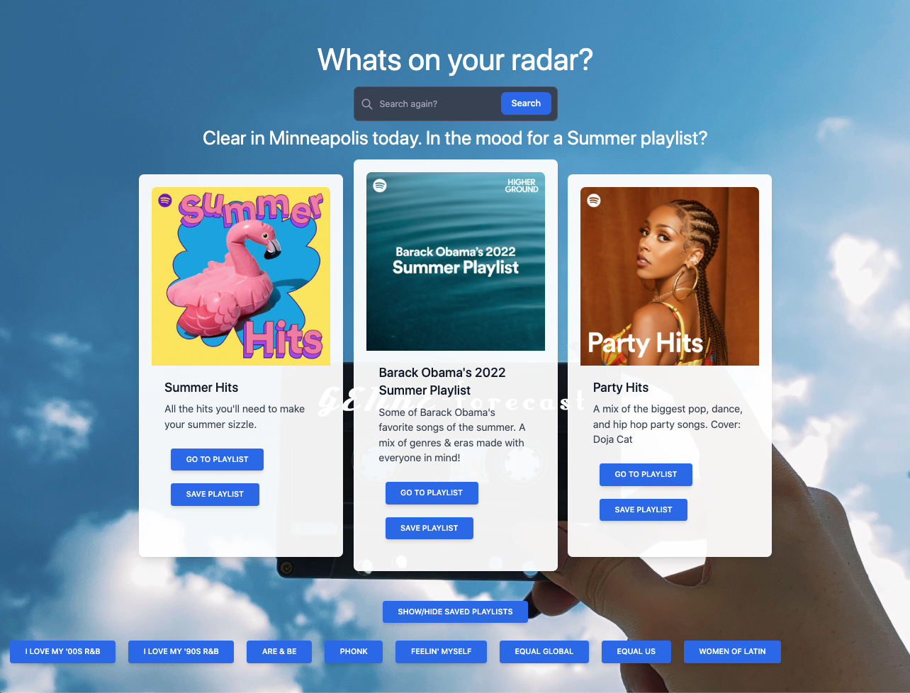

# GenreForecast

## Whats on your radar?

Whether you're stuck inside staring at the rain or thunder, or out on a jog under clear skys. Genre Forecast has the perfect playlist to match the mood.

```
WHEN: The user enters a city name
THEN: The user is presented with 3 playlists to choose from that are picked from a few categoreies that we think go with that weather type
WHEN: The user clicks on a "Go to Playlist" button
THEN: The Spotify playlist is opened in a new tab
WHEN: The user clicks on a "Save Playlist" button
THEN: A button is added to the saved playlists list with the name of the playlist
WHEN: A button in the saved playlists list is clicked, the Spotify playlist is opened in a new tab
```

## Mock-up



## Links

Github repository link: https://github.com/BryanBorek/GenreForecast

Link to deployed site: https://bryanborek.github.io/GenreForecast/